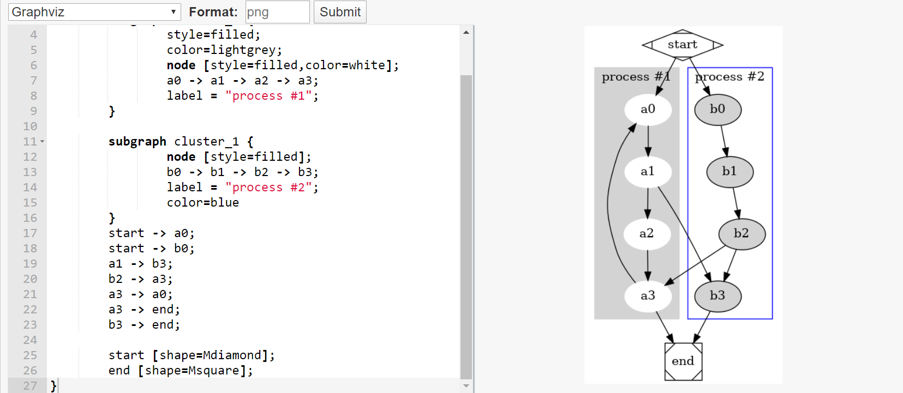

# Text to Chart API

This API is used to convert Graph Description Language (GDL) and simple text into images. Such as `dot`, `asymptote`, `ditaa`, `markdown-mindmap`, `identicon` etc.

## Quick Start

- Web Editor Demo:  https://api.annhe.net/editor.php
- Call API use `GET` or `POST` with params:

| param | description |
| ---- | ---- |
| cht  | plot engine |
| chl  | plot text |
| chof | ouput format |

- Available engine (cht)

| cht | description | note |
| ---- | ---- | -- |
| gv:(dot\|neato\|fdp\|sfdp\|twopi\|circo) | graphviz| gv=gv:dot |
| gp  | gnuplot ||
| ditaa | ditaa ||
| markdown:(dot\|neato\|fdp\|sfdp\|twopi\|circo) | markdown mindmap |markdown=markdown:dot|
| radar | radar chart ||
| msc | mscgen ||
| cover | book cover (racovimge) ||
| cover:ten | book cover (tenprintcover.py) ||
| qr | qrcode ||
| blockdiag | blockdiag ||
| asy |asymptote ||
| url2img | website screenshot ||
| avatar | identicon avatar||

## Deployment

- [Normal method](docs/deploy.md)
- [Docker](docs/docker.md)

## Demo

- [graphviz](docs/demo/graphviz.md)
- [ditaa](docs/demo/ditaa.md)
- [asymptote](docs/demo/asymptote.md)
- [gnuplot](docs/demo/gnuplot.md)
- [mindmap](docs/demo/mindmap.md)
