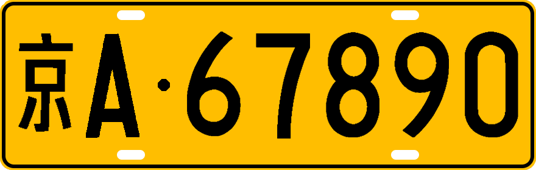
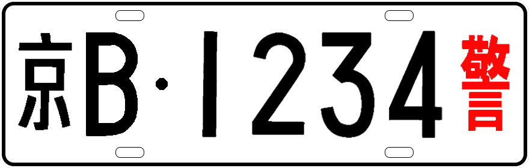

# zyan/license-plate-number

国内车牌生成器

已实现

- [x] 普通轿车(蓝牌)
- [x] 粤港澳(黑牌)
- [x] 白色警车
- [x] 白色军车
- [x] 使领馆
- [x] 中型车(黄牌)


效果图 (仅供娱乐,非完全一样)






> 免责声明: 禁止用于伪造车牌等违法行为


## 要求

1. php >= 7.4
2. Composer


## 安装

```shell
composer require zyan/license-plate-number -vvv
```

## 使用


```php
use Zyan\LicensePlateNumber\LicensePlateNumber;

$plate = new LicensePlateNumber('./temp/'); //保存路径

//普通轿车
$res = $plate->blue('京', 'A', "1", "2", "3", "4", "5");

//粤港澳
//$res = $plate->black('粤', 'Z', "6", "7", "8", "9", "港");

//中型车
//$res = $plate->yellow('京', 'A', "6", "7", "8", "9", "0");

//白色警车
//$res = $plate->white('京', 'B', "1", "2", "3", "4", "警");

//获取图片路径
$res->getFilename();

```


## 参与贡献

1. fork 当前库到你的名下
2. 在你的本地修改完成审阅过后提交到你的仓库
3. 提交 PR 并描述你的修改，等待合并

## 关于作者

- 作者博客 [blog.php127.com](http://blog.php127.com)
- PHP交流群(有问必答) [324098841](https://jq.qq.com/?_wv=1027&k=uw4uy0r3)

## License

[MIT license](https://opensource.org/licenses/MIT)
